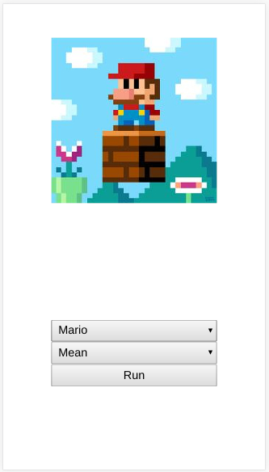
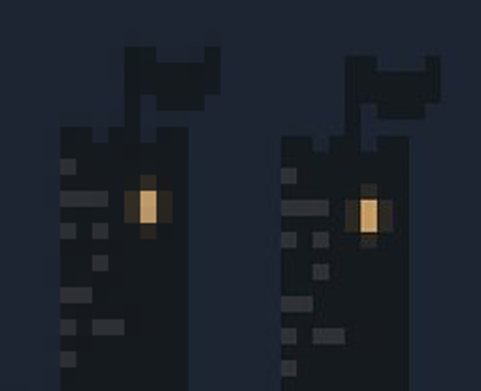

# pixelRestorer

Using statistics to restore pixel art images.



## How to use

Select the image, the way of redrawing it (mean, mode or median) and click Run or Hit Enter on the keyboard.

## About 

This is a project I've been idealizing from some time now. Is it possible to reconstruct a pixel art image that has been corrupted by scaling or compression? Well, lets give it a shot.

## The Algorithm

The first step is to determine the image's "pixel size". The algorithm does that by diving the image in windows and calculating the probability of that window being the pixel size.

```
window = imageSize / 2
window = imageSize / 4
window = imageSize / 6
...
```

The window is a squared matrix. 3x3, 6x6, 8x8...

It stores all the probabilities in a dictionary then returns the most likely to be the right pixel size - the greater value.

The algorithm caculates the probability of the window by getting the mean - sum of pixels devided by total pixels - of the area and comparing it to the median - element on the center of the array - plus some threshold. That's a way I found to calculate the entropy of the window. A window with low entropy must mean that the pixels in there are smiliar, right?!

The second step is to redraw the image pixelSize by pixelSize getting the mean, mode or median of each pixelSize. E.g.: The algorithm determined that the pixelSize is 8x8. So, it gets a 8x8 patch of the image, take the mean, the mode or the median and redraw every real pixel (1x1) with that value. So now the pixelSize - the window of 8x8 - is now filled with pixels of the same value.

Here's a comparison:



It got rid of most artefacts caused by scaling or compressing the original image.

## Known problems

The algorithm does not work 100% of the cases nor with every possible image. For example, it doesn't work if the pixelSize is offsetted or if the image has a large area of the same color - as a background for instance.

If most of the image is similar, like a image with a large solid white color as background and just a small portion of it being the pixel art, it can't figure out the right size of the pixelSize. Cause every window will have a low entropy value (since its most white, no matter what).
